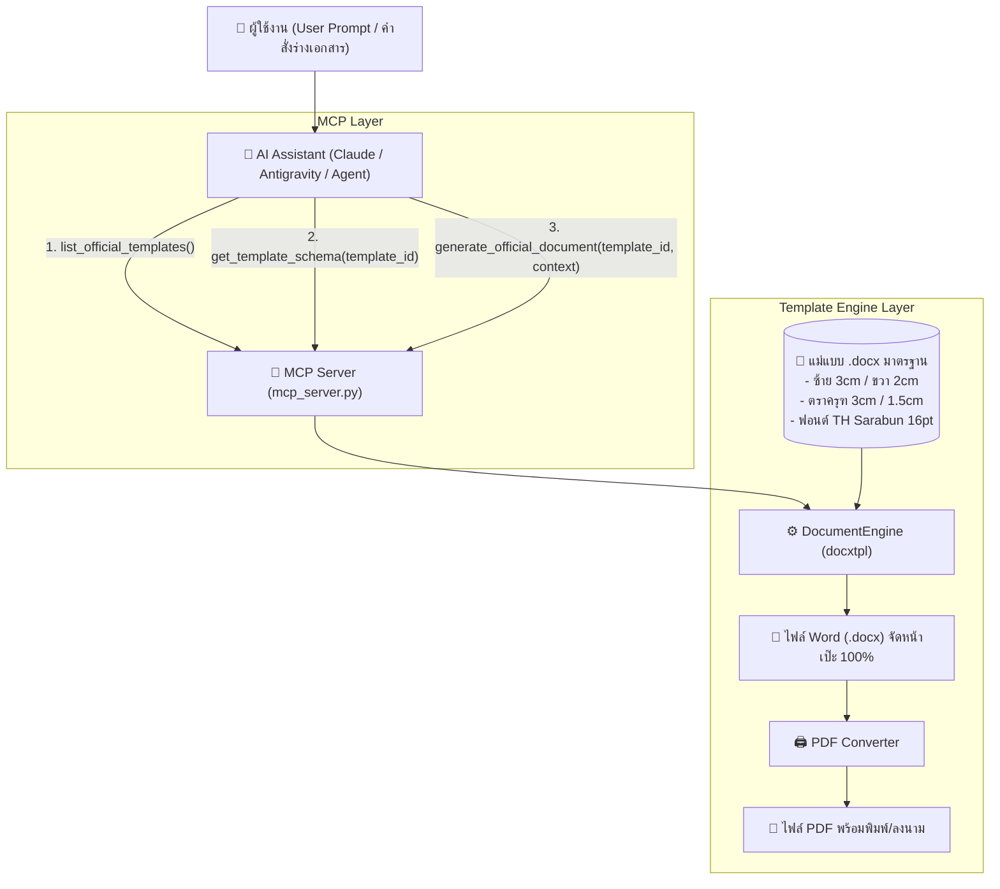

# ระบบจัดทำเอกสารทางการและเอกสารราชการไทยด้วย MCP Template Engine

> **Model Context Protocol (MCP) Server** สำหรับจัดการเอกสารทางการไทยด้วยเทคโนโลยี **Template Engine (`docxtpl` + `python-docx`)**  
> ป้องกันปัญหาฟอร์แมตเพี้ยน 100% พร้อมคงมาตรฐานตาม **ระเบียบสำนักนายกรัฐมนตรีว่าด้วยงานสารบรรณ พ.ศ. ๒๕๒๖**

---

## 🏛️ 1. หลักการทำงานและสถาปัตยกรรม (Architecture)

### ปัญหาของการให้ LLM สร้างไฟล์เอกสารโดยตรง:
1. **โครงสร้างและระยะขอบเพี้ยน**: AI ไม่สามารถคำนวณระยะขอบ (ซ้าย 3 ซม. ขวา 2 ซม. บน 2.5 ซม. ล่าง 2 ซม.) ได้คงที่
2. **ตำแหน่งตราครุฑและตารางหัวเรื่องเลื่อน**: ขนาดและพิกัดของรูปตราครุฑมักผิดสัดส่วน
3. **การตัดคำและย่อหน้าไม่เป็นไปตามระเบียบ**: ย่อหน้า 2.5 ซม. และบรรทัดลายมือชื่อมักเยื้องผิดตำแหน่ง

### วิธีแก้ด้วย Template Engine + MCP (แนะนำที่สุด):
แม่แบบเอกสาร `.docx` จะถูกออกแบบและล็อกโครงสร้างไว้ล่วงหน้าอย่างสมบูรณ์ (ฟอนต์ TH Sarabun PSK 16pt, ระยะขอบ, ตราครุฑ, ตาราง, ระยะย่อหน้า) และมี Placeholder แท็ก Jinja2 (เช่น `{{ doc_no }}`, `{{ subject }}`, `{{ intro_paragraph }}`)  
**AI จะทำหน้าที่เฉพาะสิ่งที่ถนัดที่สุด** คือ:
1. วิเคราะห์คำสั่ง/บริบทของผู้ใช้
2. สกัดและเรียบเรียงเนื้อหาให้อยู่ในรูปแบบ **Structured JSON**
3. เรียกใช้ MCP Tool เพื่อส่ง JSON เข้าไปแทนที่ใน Template ทันที



---

## 📂 2. โครงสร้างโปรเจกต์ (Project Structure)

```text
D:\project-mobile application\
├── mcp_server.py           # ตัวรัน MCP Server (รองรับ FastMCP / MCPServer stdio transport)
├── document_engine.py      # Core Engine สำหรับ Render Template และแปลงไฟล์
├── template_builder.py     # สคริปต์สร้างแม่แบบมาตรฐานราชการไทย (.docx) อัตโนมัติ
├── test_generator.py       # สคริปต์ทดสอบเรนเดอร์เอกสารทุกประเภท
├── mcp_config.json         # ไฟล์ตั้งค่า MCP สำหรับนำไปใช้ใน AI Client ต่างๆ
├── assets\
│   └── garuda.png          # ภาพตราครุฑความละเอียดสูง
├── templates\              # โฟลเดอร์เก็บแม่แบบเอกสารราชการ
│   ├── memo_internal.docx   # บันทึกข้อความ (หนังสือภายใน)
│   ├── letter_external.docx # หนังสือภายนอก
│   ├── official_order.docx  # คำสั่ง
│   └── meeting_minutes.docx # รายงานการประชุม
└── output\                 # โฟลเดอร์เก็บเอกสารที่สร้างสำเร็จ
    ├── ตัวอย่าง_บันทึกข้อความ.docx
    ├── ตัวอย่าง_หนังสือภายนอก.docx
    ├── ตัวอย่าง_คำสั่ง.docx
    └── ตัวอย่าง_รายงานการประชุม.docx
```

---

## 🛠️ 3. เครื่องมือ MCP Tools ที่มีให้ใช้งาน

| MCP Tool Name | รายละเอียด | พารามิเตอร์ |
| :--- | :--- | :--- |
| `list_official_templates` | แสดงรายชื่อแม่แบบเอกสารราชการทั้งหมดในระบบ | - |
| `get_template_schema` | ดูรายละเอียดโครงสร้าง JSON และตัวแปร (Fields) ของแม่แบบ | `template_id` (str) |
| `generate_official_document` | สั่งเรนเดอร์เอกสารราชการ `.docx` จากข้อมูล JSON | `template_id` (str), `context` (dict), `output_filename` (optional) |
| `convert_document_to_pdf` | แปลงไฟล์ `.docx` เป็นไฟล์ `.pdf` คุณภาพสูง | `docx_path` (str), `output_pdf_path` (optional) |
| `rebuild_all_templates` | สร้างแม่แบบ `.docx` มาตรฐานใหม่อัตโนมัติ | - |

---

## ⚙️ 4. วิธีการติดตั้งและตั้งค่า MCP ใน Client

### 4.1 ติดตั้ง Dependencies (Python 3.10+)
```powershell
pip install docxtpl python-docx mcp pywin32 customtkinter google-generativeai
```

### 4.2 การเชื่อมต่อกับ Claude Desktop / Antigravity / Cursor
เพิ่มการตั้งค่าลงในไฟล์ Configuration ของ Client:

**สำหรับ Claude Desktop (`%APPDATA%\Claude\claude_desktop_config.json`) หรือ Cursor / Antigravity:**
```json
{
  "mcpServers": {
    "thai-gov-doc-engine": {
      "command": "C:\\Users\\This PC\\AppData\\Local\\Programs\\Python\\Python310\\python.exe",
      "args": [
        "D:\\project-mobile application\\mcp_server.py"
      ],
      "env": {
        "PYTHONIOENCODING": "utf-8"
      }
    }
  }
}
```

---

## 📝 5. ตัวอย่างการเรียกใช้งาน (Workflow ตัวอย่าง)

### ขั้นตอนที่ 1: AI ตรวจสอบ Schema
AI ส่ง Tool Call:
```json
get_template_schema({"template_id": "memo_internal"})
```

### ขั้นตอนที่ 2: AI สรุปข้อมูลและส่ง JSON Context
AI วิเคราะห์คำสั่งและแปลงเป็น JSON:
```json
generate_official_document({
  "template_id": "memo_internal",
  "context": {
    "agency_name": "กองพัฒนาระบบดิจิทัลและปัญญาประดิษฐ์",
    "tel": "0 2123 4567",
    "doc_no": "ดศ 0401/1234",
    "doc_date": "๒๘ สิงหาคม ๒๕๖๙",
    "subject": "ขออนุมัติจัดโครงการสัมมนาเชิงปฏิบัติการด้าน AI Agent และ MCP",
    "to_recipient": "ผู้อำนวยการสำนักบริหารเทคโนโลยีสารสนเทศ",
    "intro_paragraph": "ด้วยกลุ่มงานพัฒนาระบบดิจิทัลมีความประสงค์จะจัดโครงการสัมมนาเชิงปฏิบัติการ...",
    "detail_paragraph": "การจัดสัมมนาดังกล่าวมีกำหนดจัดขึ้นในวันที่ ๑๕ กันยายน ๒๕๖๙...",
    "bullet_items": [
      "อบรมการใช้งาน Template Engine กับเอกสารราชการ",
      "ฝึกปฏิบัติการเชื่อมต่อ MCP Server กับผู้ช่วย AI"
    ],
    "conclusion_paragraph": "จึงเรียนมาเพื่อโปรดพิจารณาอนุมัติ...",
    "signer_name": "นายสมศักดิ์ นวัตกรรม",
    "signer_position": "หัวหน้ากลุ่มงานพัฒนาระบบดิจิทัล"
  },
  "output_filename": "บันทึกขออนุมัติโครงการ.docx"
})
```

---

## 🏆 6. จุดเด่นและข้อดีของแนวทางนี้

1. **ถูกต้องตามระเบียบงานสารบรรณ 100%**:
   - การตั้งระยะขอบ: ซ้าย 3.0 ซม., ขวา 2.0 ซม., บน 2.5 ซม., ล่าง 2.0 ซม.
   - ฟอนต์: `TH Sarabun PSK` ขนาด 16pt สำหรับเนื้อหา, 20-29pt สำหรับหัวข้อ
   - ตราครุฑ: ครุฑความละเอียดสูงขนาด 1.5 ซม. (หนังสือภายใน) และ 3.0 ซม. (หนังสือภายนอก/คำสั่ง)
2. **ควบคุมโครงสร้างได้เข้มงวดที่สุด (Deterministic Output)**: หมดปัญหาเรื่องตารางหัวเรื่องเบี้ยว หรือการเว้นวรรคภาษาไทยเพี้ยน
3. **รองรับ Dynamic Lists & Tables**: ใช้ Jinja2 syntax วนลูปรายชื่อผู้เข้าร่วมประชุม วาระการประชุม หรือรายการข้อกำหนดในคำสั่งได้ไม่จำกัด
4. **พร้อมต่อยอดสู่ระบบ e-Saraban**: รองรับการแปลงเป็น PDF เพื่อส่งต่อเข้าสู่ระบบลงนามอิเล็กทรอนิกส์ (Digital Signature) ต่อไป

---

## 🖥️ 7. CampusMate AI Document Editor

เปิดโปรแกรมด้วยการดับเบิลคลิก `start_ai_editor.bat` หรือเรียกใช้คำสั่งตรวจสอบก่อน:

```powershell
.\start_ai_editor.bat --check
```

ตัวอย่างคำสั่งที่ระบบรองรับแบบระบุจุดชัดเจน:

- `ช่วยแก้ชื่อสมาชิกคนที่ 1 เป็น นายสมชาย ใจดี รหัส 6610210001`
- `แก้ขอบเขตข้อที่ 2 เป็น ระบบจัดการโปรไฟล์สมาชิก`
- `เปลี่ยนชื่อโครงการเป็น CampusMate`
- `ให้ AI จัดเรียงเอกสารข้อเสนอโครงการใหม่ตามลำดับมาตรฐาน`
- `ช่วยวิเคราะห์เอกสารฉบับนี้ว่ามีจุดไหนควรปรับปรุงหรือเพิ่มเติมบ้าง`

ระบบจะแก้เฉพาะส่วนที่ระบุ แสดงรายการ field ที่เปลี่ยน และไม่สร้างเอกสารซ้ำหากค่าเดิมอยู่แล้ว คำสั่งจัดเรียงจะจัดโครงสร้างตามลำดับ ปัญหา → วัตถุประสงค์และขอบเขต → ผู้ใช้งาน → ระบบ → การทำงาน → แผนงาน → ผลลัพธ์ พร้อมจัดเลขรายการให้ต่อเนื่อง หาก Word หรือ OneDrive ล็อกไฟล์อยู่ ระบบจะบันทึกชื่อสำรองแบบมีลำดับและ UI จะเปิดไฟล์ล่าสุดให้โดยอัตโนมัติ

---

## 📱 8. CampusMate Mobile App (MVP)

ต้นแบบแอปมือถือจากรายงานข้อเสนอโครงการอยู่ที่ `App.js` และ `src/` โดยรองรับ Android, iOS และ Web ผ่าน Expo

### ฟังก์ชันตามขอบเขตรายงาน

- Google Sign-In แบบ demo เพื่อทดสอบ flow ได้ทันที และมีจุดเชื่อมต่อ Firebase ใน `src/services/authService.js`
- โปรไฟล์นักศึกษา: คณะ ชั้นปี ทักษะ/เพซ ช่วงเวลาว่าง และข้อความแนะนำตัว
- การ์ดจับคู่พร้อมตัวกรองกิจกรรม คณะเดียวกัน และช่วงเวลาว่าง
- ห้องแชตส่วนตัวหลังจับคู่ พร้อมส่งข้อความและตัวนับข้อความที่ยังไม่ได้อ่าน
- จุดนัดหมายแนะนำภายในมหาวิทยาลัย พร้อมปักหมุด/ยกเลิกจุดนัดหมาย

### วิธีเปิดแอป

```powershell
cd "D:\project-mobile application"
pnpm start
```

จากนั้นกด `w` เพื่อเปิด Web หรือสแกน QR ด้วย Expo Go สำหรับโทรศัพท์มือถือ

การเข้าสู่ระบบตอนนี้เป็น demo mode โดยตั้งใจไม่เก็บ credential ไว้ใน source code หากจะเชื่อม Firebase จริง ให้ตั้งค่า `EXPO_PUBLIC_FIREBASE_API_KEY` และ `EXPO_PUBLIC_FIREBASE_PROJECT_ID` แล้วต่อ provider ใน `src/services/authService.js`
